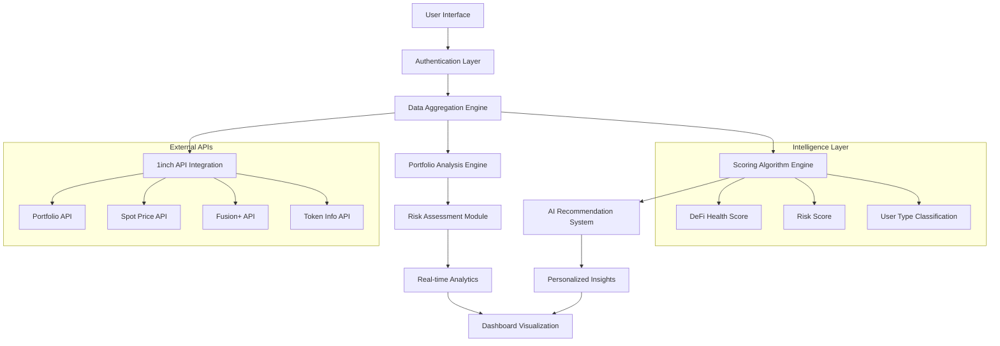
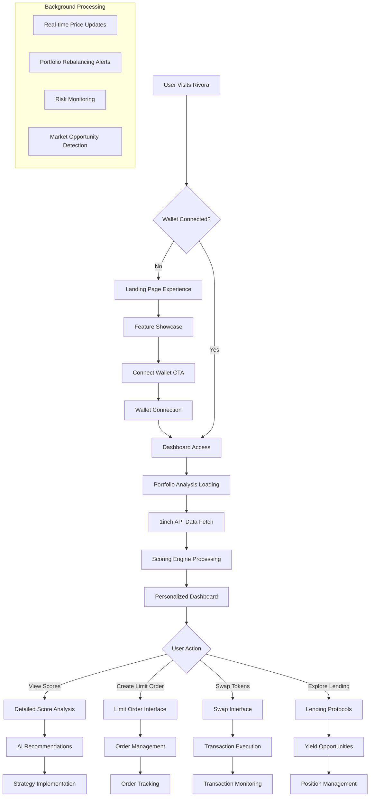
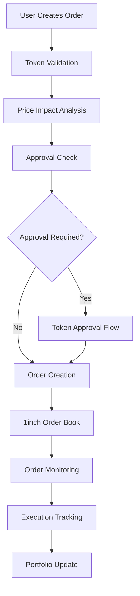

# 🌟 Rivora DeFi Analytics Platform

[](https://nextjs.org/)
[](https://www.typescriptlang.org/)
[](https://1inch.io/)
[](https://wagmi.sh/)
[](https://tailwindcss.com/)

> **A revolutionary DeFi analytics platform that transforms complex blockchain data into actionable insights through AI-powered scoring algorithms.**

---

## 🎯 **Vision & Mission**

### **Our Vision**
To democratize DeFi analytics by making sophisticated financial intelligence accessible to every user, from beginners to institutional investors. We envision a future where every DeFi participant can make informed decisions based on comprehensive, AI-driven insights.

### **Our Mission**
Rivora serves as the **intelligence layer** for the DeFi ecosystem, providing:
- **Real-time risk assessment** across multiple protocols
- **Personalized trading strategies** based on user behavior analysis
- **Comprehensive portfolio health monitoring** with predictive analytics
- **Seamless integration** with leading DeFi protocols through 1inch APIs

---

## 🌍 **The DeFi Problem We Solve**

### **Current Challenges in DeFi:**

1. **Information Fragmentation** 📊
   - Users struggle to aggregate data from multiple protocols
   - Lack of unified analytics across different blockchains
   - Complex metrics that require deep technical knowledge

2. **Risk Assessment Complexity** ⚠️
   - Manual portfolio risk calculation is time-consuming
   - No standardized scoring system for DeFi health
   - Limited predictive analytics for market movements

3. **User Experience Barriers** 🚧
   - Overwhelming interfaces for non-technical users
   - Lack of personalized recommendations
   - No intelligent automation for trading strategies

### **Our Solution: AI-Powered DeFi Intelligence**

Rivora addresses these challenges through:
- **Unified Analytics Dashboard** with real-time data aggregation
- **Proprietary Scoring Algorithms** that distill complex metrics into actionable scores
- **Personalized User Insights** powered by behavioral analysis
- **Automated Trading Tools** with intelligent limit order management

---

## 🏗️ **Platform Architecture**

### **Core System Components**



### **Technology Stack**

#### **Frontend Architecture**
- **Framework**: Next.js 14.2.30 with App Router
- **Language**: TypeScript for type safety
- **Styling**: Tailwind CSS with custom animations
- **State Management**: React hooks with custom data fetching
- **Web3 Integration**: Wagmi + RainbowKit for wallet connectivity

#### **Backend Services**
- **API Routes**: Next.js API routes for serverless functions
- **Data Processing**: Custom scoring engines and analytics
- **External Integration**: 1inch API suite for DeFi data
- **Real-time Updates**: Optimized polling with intelligent caching

#### **Scoring Engine Architecture**
```typescript
interface ScoringEngine {
  deFiHealthScore: (portfolio: Portfolio) => HealthMetrics;
  riskAssessment: (transactions: Transaction[]) => RiskProfile;
  userClassification: (behavior: UserBehavior) => UserType;
  predictiveAnalytics: (historical: HistoricalData) => Predictions;
}
```

---

## 🔗 **1inch API Integration**

### **Comprehensive API Utilization**

Our platform leverages the complete 1inch API ecosystem:

#### **1. Portfolio API** 📈
- **Purpose**: Real-time portfolio valuation and token holdings
- **Implementation**: `/api/portfolio` endpoint
- **Data Sources**: 
  - Current portfolio value across multiple chains
  - Token balances with USD conversion
  - Historical performance tracking
  - Profit/loss calculations

```typescript
// Portfolio API Integration Flow
const portfolioData = await getPortfolioData(walletAddress, chainId);
const enrichedData = await processPortfolioMetrics(portfolioData);
const scoringInput = transformToScoringFormat(enrichedData);
```

#### **2. Spot Price API** 💰
- **Purpose**: Real-time token pricing for accurate valuations
- **Implementation**: Dynamic price fetching with caching
- **Features**:
  - Multi-token price aggregation
  - Price change tracking (24h)
  - Cross-chain price normalization

#### **3. Token API** 🔍
- **Purpose**: Comprehensive token metadata and verification
- **Implementation**: `/api/tokens` with search and validation
- **Data Points**:
  - Token contract addresses
  - Decimals and symbol information
  - Logo URLs and verification status
  - Trading pair availability

#### **4. Fusion+ Integration** 🚀
- **Purpose**: Advanced swap optimization and MEV protection
- **Implementation**: Limit order system with Fusion+ backend
- **Benefits**:
  - Gas cost optimization
  - MEV protection for users
  - Intelligent order routing
  - Partial fill support

### **API Rate Limiting & Optimization**

We implement sophisticated rate limiting to ensure optimal performance:

```typescript
// Rate Limiting Strategy
const API_RATE_LIMITS = {
  portfolio: { requests: 10, window: 60000 }, // 10 requests per minute
  pricing: { requests: 30, window: 60000 },   // 30 requests per minute
  tokens: { requests: 50, window: 60000 }     // 50 requests per minute
};

// Intelligent Caching Layer
const CACHE_STRATEGIES = {
  portfolio: 60000,    // 1 minute cache
  prices: 30000,       // 30 second cache
  tokens: 300000       // 5 minute cache
};
```

---

## 🧠 **AI-Powered Scoring System**

### **Core Scoring Algorithms**

#### **1. DeFi Health Score (0-100)** ❤️

**Purpose**: Comprehensive portfolio health assessment

**Calculation Factors**:
- **Portfolio Diversification** (25%)
  - Token distribution across assets
  - Protocol exposure analysis
  - Risk concentration metrics

- **Liquidity Assessment** (20%)
  - Asset liquidity ratios
  - Market depth analysis
  - Slippage risk calculation

- **Protocol Risk Analysis** (25%)
  - Smart contract security scores
  - Protocol maturity assessment
  - TVL stability metrics

- **Market Timing Indicators** (15%)
  - Entry/exit timing analysis
  - Market cycle positioning
  - Volatility exposure

- **Yield Optimization** (15%)
  - Current yield efficiency
  - Opportunity cost analysis
  - Compound growth potential

```typescript
// Health Score Calculation Engine
function calculateHealthScore(portfolio: Portfolio): HealthScore {
  const diversification = analyzeDiversification(portfolio.tokens);
  const liquidity = assessLiquidity(portfolio.positions);
  const protocolRisk = evaluateProtocolRisk(portfolio.protocols);
  const marketTiming = analyzeMarketTiming(portfolio.history);
  const yieldOptimization = calculateYieldEfficiency(portfolio.yields);
  
  return weightedAverage([
    { score: diversification, weight: 0.25 },
    { score: liquidity, weight: 0.20 },
    { score: protocolRisk, weight: 0.25 },
    { score: marketTiming, weight: 0.15 },
    { score: yieldOptimization, weight: 0.15 }
  ]);
}
```

#### **2. Risk Assessment Score (0-100)** ⚠️

**Purpose**: Quantify portfolio risk exposure

**Risk Categories**:
- **Impermanent Loss Risk**: LP position analysis
- **Smart Contract Risk**: Protocol security assessment
- **Market Risk**: Volatility and correlation analysis
- **Liquidity Risk**: Exit difficulty measurement
- **Regulatory Risk**: Compliance and jurisdiction factors

#### **3. User Type Classification** 👤

**Purpose**: Behavioral pattern recognition for personalized insights

**Classification Types**:
- **Conservative Holder**: Low-risk, long-term strategies
- **Active Trader**: High-frequency, market-timing strategies
- **Yield Farmer**: DeFi protocol optimization focus
- **Explorer**: Early adopter, high-risk tolerance
- **Optimizer**: Efficiency and cost-minimization focus

### **Machine Learning Integration**

```typescript
// User Behavior Analysis
interface UserBehaviorAnalyzer {
  transactionFrequency: number;
  averageTransactionSize: number;
  protocolDiversity: number;
  riskTolerance: number;
  yieldSeekingBehavior: number;
  timeHorizonPreference: 'short' | 'medium' | 'long';
}

// Predictive Analytics Engine
function generateRecommendations(
  userType: UserType,
  portfolioHealth: HealthScore,
  marketConditions: MarketData
): Recommendation[] {
  // AI-driven recommendation logic
  return personalizedStrategies.filter(strategy => 
    strategy.suitability[userType] > 0.8 &&
    strategy.riskLevel <= userType.riskTolerance
  );
}
```

---

## 🔄 **User Journey Flow**

### **Complete User Experience Flowchart**



### **Data Processing Pipeline**


---

## 💡 **Key Features Deep Dive**

### **1. Intelligent Dashboard** 🎛️

**Core Components**:
- **AI Insight Score**: Aggregate intelligence metric (0-100)
- **Real-time Portfolio Tracking**: Live valuation updates
- **Personalized Recommendations**: AI-driven strategy suggestions
- **Risk Alerts**: Automated warning system for portfolio risks

**Technical Implementation**:
```typescript
// Dashboard Data Aggregation
const DashboardEngine = {
  async aggregateData(walletAddress: string) {
    const [portfolio, scores, market] = await Promise.all([
      fetchPortfolioData(walletAddress),
      calculateUserScores(walletAddress),
      getRealTimeMarketData()
    ]);
    
    return {
      insights: generateInsights(portfolio, scores, market),
      recommendations: createRecommendations(scores.userType),
      alerts: monitorRiskFactors(portfolio, market)
    };
  }
};
```

### **2. Advanced Limit Order System** 📋

**Features**:
- **Intelligent Pricing**: Market analysis for optimal limit prices
- **Partial Fill Support**: Maximize execution opportunities
- **MEV Protection**: Fusion+ integration for frontrunning protection
- **Multi-timeframe Orders**: Flexible expiration management

**Order Management Flow**:


### **3. Comprehensive Scoring System** 📊

**Multi-dimensional Analysis**:
- **Health Score**: Overall portfolio wellness
- **Risk Score**: Exposure and vulnerability assessment
- **Efficiency Score**: Gas optimization and execution quality
- **Opportunity Score**: Market timing and yield potential

### **4. Real-time Analytics** 📈

**Market Intelligence**:
- **Price Movement Tracking**: Multi-token price monitoring
- **Volume Analysis**: Trading activity insights
- **Liquidity Assessment**: Market depth evaluation
- **Trend Identification**: Pattern recognition algorithms

---

## 🚧 **Development Roadmap & Future Enhancements**

### **Phase 1: Foundation (Current)** ✅
- [x] Core dashboard with 1inch API integration
- [x] Basic scoring algorithms implementation
- [x] Limit order functionality with mock data
- [x] Real-time portfolio tracking
- [x] User wallet integration with RainbowKit

### **Phase 2: Enhanced Intelligence (Q2 2024)** 🔄
- [ ] **Advanced AI Models**: Machine learning for pattern recognition
- [ ] **Cross-chain Analytics**: Multi-blockchain portfolio analysis
- [ ] **Social Trading Features**: Community-driven insights
- [ ] **Automated Rebalancing**: AI-powered portfolio optimization
- [ ] **Mobile Application**: React Native implementation

### **Phase 3: Institutional Features (Q3 2024)** 🏢
- [ ] **Multi-wallet Management**: Portfolio aggregation across wallets
- [ ] **Team Collaboration**: Shared analytics and strategies
- [ ] **Advanced Reporting**: PDF exports and custom metrics
- [ ] **API Access**: Developer API for third-party integrations
- [ ] **White-label Solutions**: Customizable platform instances

### **Phase 4: DeFi Ecosystem Integration (Q4 2024)** 🌐
- [ ] **Protocol Partnerships**: Direct integrations with major DeFi protocols
- [ ] **Yield Farming Automation**: Intelligent yield optimization
- [ ] **Insurance Integration**: Portfolio protection mechanisms
- [ ] **Governance Participation**: Automated voting strategies
- [ ] **Tax Optimization**: Transaction categorization and reporting

---

## 📊 **Mock Data & Production Transition**

### **Current Mock Data Implementation**

To ensure a seamless user experience during development and testing, we implement intelligent mock data that simulates real-world scenarios:

#### **Portfolio Mock Data** 📈
**Purpose**: Demonstrate platform capabilities when users have limited transaction history

**Implementation Strategy**:
```typescript
// Realistic Portfolio Simulation
const generateMockPortfolio = (walletAddress: string): Portfolio => {
  return {
    totalValue: randomBetween(10000, 100000),
    tokens: [
      { symbol: 'ETH', percentage: 45, value: 'calculated' },
      { symbol: 'USDC', percentage: 25, value: 'calculated' },
      { symbol: 'AAVE', percentage: 15, value: 'calculated' },
      // ... additional tokens with realistic distributions
    ],
    performance: generateRealisticPerformance(),
    riskMetrics: calculatePortfolioRisk()
  };
};
```

**Transition to Production**:
- Mock data is automatically replaced when sufficient real data is available
- Fallback mechanisms ensure platform functionality during API downtime
- Clear indicators show users when viewing simulated vs. real data

#### **Limit Order Mock Data** 📋
**Purpose**: Showcase order management capabilities and interface design

**Current Implementation**:
- Realistic order structures with proper token addresses
- Status progression simulation (active → partially filled → completed)
- Time-based order expiration modeling

**Production Migration Path**:
1. **Phase 1**: Direct 1inch Order Book API integration
2. **Phase 2**: Real-time order status updates via WebSocket
3. **Phase 3**: Advanced order types (stop-loss, take-profit)

#### **Scoring Algorithm Mock Data** 🧠
**Purpose**: Demonstrate AI insights while building user behavior database

**Sophisticated Simulation**:
```typescript
// Behavioral Pattern Simulation
const simulateUserBehavior = (transactionHistory: Transaction[]): UserProfile => {
  // Analyze real transaction patterns when available
  if (transactionHistory.length > 10) {
    return analyzeRealBehavior(transactionHistory);
  }
  
  // Generate realistic behavioral patterns for new users
  return generateRealisticUserProfile();
};
```

### **Production Data Sources**

#### **Real-time Data Integration**
- **1inch Portfolio API**: Live portfolio valuations
- **1inch Spot Price API**: Current market prices
- **1inch Fusion+ API**: Advanced trading data
- **Blockchain RPC**: Direct on-chain data verification

#### **Data Quality Assurance**
- **Multiple Source Verification**: Cross-referencing data across APIs
- **Fallback Mechanisms**: Graceful degradation during API issues
- **Cache Invalidation**: Intelligent cache management for data freshness

---

## 🔧 **Technical Implementation Details**

### **API Architecture**

#### **Modular API Design**
```typescript
// API Service Architecture
interface APIService {
  portfolio: PortfolioService;
  pricing: PricingService;
  tokens: TokenService;
  orders: OrderService;
  analytics: AnalyticsService;
}

// Service Implementation
class PortfolioService {
  async getPortfolioData(address: string, chainId: number): Promise<Portfolio> {
    const response = await this.fetchWithRetry('/api/portfolio', {
      method: 'POST',
      body: JSON.stringify({ walletAddress: address, chainId })
    });
    
    return this.transformPortfolioData(response);
  }
}
```

#### **Error Handling & Resilience**
```typescript
// Robust Error Handling
const withErrorHandling = async <T>(
  operation: () => Promise<T>,
  fallback: T,
  context: string
): Promise<T> => {
  try {
    return await operation();
  } catch (error) {
    console.error(`${context} failed:`, error);
    analytics.track('api_error', { context, error: error.message });
    return fallback;
  }
};
```

### **Performance Optimization**

#### **Caching Strategy**
- **Portfolio Data**: 60-second cache with stale-while-revalidate
- **Price Data**: 30-second cache with aggressive prefetching
- **User Scores**: 5-minute cache with background updates

#### **Bundle Optimization**
- **Code Splitting**: Route-based and component-based splitting
- **Tree Shaking**: Elimination of unused dependencies
- **Image Optimization**: Next.js automatic image optimization

### **Security Measures**

#### **API Security**
- **Rate Limiting**: Prevents API abuse and ensures fair usage
- **Input Validation**: Comprehensive validation for all user inputs
- **Wallet Verification**: Cryptographic signature verification

#### **Data Privacy**
- **No Personal Data Storage**: Only wallet addresses and preferences
- **Local State Management**: Sensitive data kept in browser memory
- **HTTPS Enforcement**: All communications encrypted in transit

---

## 🚀 **Getting Started**

### **Prerequisites**
- **Node.js**: Version 18.0 or higher
- **npm**: Version 8.0 or higher
- **Web3 Wallet**: MetaMask, WalletConnect, or compatible wallet

### **Installation & Setup**

1. **Clone the Repository**
```bash
git clone https://github.com/your-username/rivora-defi-platform.git
cd rivora-defi-platform
```

2. **Install Dependencies**
```bash
npm install
```

3. **Environment Configuration**
```bash
# Copy environment template
cp .env.example .env.local

# Configure required variables
NEXT_PUBLIC_WALLET_CONNECT_PROJECT_ID=your_project_id
NEXT_PUBLIC_1INCH_API_KEY=your_1inch_api_key
```

4. **Development Server**
```bash
npm run dev
```

5. **Production Build**
```bash
npm run build
npm start
```

### **Configuration Options**

#### **Environment Variables**
```bash
# Required Configuration
NEXT_PUBLIC_WALLET_CONNECT_PROJECT_ID=    # WalletConnect v2 Project ID
NEXT_PUBLIC_1INCH_API_KEY=                # 1inch API access key

# Optional Configuration
NEXT_PUBLIC_ANALYTICS_ID=                 # Analytics tracking ID
NEXT_PUBLIC_SENTRY_DSN=                   # Error monitoring
NEXT_PUBLIC_FEATURE_FLAGS=                # Feature toggle configuration
```

#### **Custom Configuration**
```typescript
// config/platform.ts
export const PlatformConfig = {
  scoring: {
    updateInterval: 300000,      // 5 minutes
    cacheTimeout: 600000,        // 10 minutes
    fallbackEnabled: true
  },
  ui: {
    theme: 'cosmic',
    animations: true,
    responsiveBreakpoints: { ... }
  },
  features: {
    limitOrders: true,
    socialTrading: false,        // Coming soon
    crossChain: false            // Coming soon
  }
};
```

---

## 📱 **User Interface Design Philosophy**

### **Design Principles**

#### **1. Progressive Disclosure** 📊
- **Beginner Mode**: Simplified metrics and clear explanations
- **Advanced Mode**: Detailed analytics and technical indicators
- **Expert Mode**: Raw data access and customizable dashboards

#### **2. Cosmic Aesthetic** 🌌
- **Visual Theme**: Space-inspired design with deep purples and cosmic gradients
- **Animation Philosophy**: Smooth, purposeful animations that enhance understanding
- **Typography**: Clean, readable fonts optimized for financial data

#### **3. Accessibility First** ♿
- **Screen Reader Support**: Comprehensive ARIA labels and semantic HTML
- **Keyboard Navigation**: Full functionality without mouse interaction
- **Color Contrast**: WCAG AA compliant color schemes
- **Responsive Design**: Optimized for all device sizes

### **Component Architecture**

#### **Design System**
```typescript
// Component Design Tokens
const DesignTokens = {
  colors: {
    primary: 'var(--cosmic-purple)',
    secondary: 'var(--cosmic-cyan)',
    accent: 'var(--cosmic-pink)',
    background: 'var(--cosmic-dark)',
    surface: 'var(--cosmic-surface)'
  },
  typography: {
    display: 'Inter, sans-serif',
    body: 'Inter, sans-serif',
    mono: 'JetBrains Mono, monospace'
  },
  spacing: {
    scale: 'geometric progression',
    baseUnit: '0.25rem'
  }
};
```

#### **Reusable Components**
- **Dashboard Cards**: Modular, responsive data containers
- **Chart Components**: Interactive financial visualizations
- **Form Elements**: Consistent input styling and validation
- **Modal System**: Layered interaction patterns

---

## 🧪 **Testing Strategy**

### **Comprehensive Testing Approach**

#### **Unit Testing**
```typescript
// Example: Scoring Algorithm Tests
describe('DeFi Health Score Calculation', () => {
  test('should calculate correct diversification score', () => {
    const portfolio = createMockPortfolio({
      tokens: [
        { symbol: 'ETH', percentage: 50 },
        { symbol: 'USDC', percentage: 30 },
        { symbol: 'AAVE', percentage: 20 }
      ]
    });
    
    const diversificationScore = calculateDiversification(portfolio);
    expect(diversificationScore).toBeGreaterThan(70);
  });
});
```

#### **Integration Testing**
- **API Integration**: Mock 1inch API responses for consistent testing
- **Wallet Integration**: Simulated wallet connections and transactions
- **State Management**: Redux-like state transitions and side effects

#### **End-to-End Testing**
- **User Journeys**: Complete user workflows from landing to trading
- **Cross-browser Compatibility**: Testing across Chrome, Firefox, Safari
- **Performance Testing**: Load times and responsiveness metrics

---

## 🔐 **Security & Privacy**

### **Security Architecture**

#### **Client-Side Security**
- **No Private Key Storage**: Wallet providers handle key management
- **Secure Communication**: All API calls use HTTPS encryption
- **XSS Protection**: Content Security Policy and input sanitization
- **CSRF Protection**: Token-based request validation

#### **API Security**
```typescript
// Rate Limiting Implementation
const rateLimiter = rateLimit({
  windowMs: 15 * 60 * 1000,    // 15 minutes
  max: 100,                     // Limit each IP to 100 requests per windowMs
  message: 'Too many requests from this IP',
  standardHeaders: true,
  legacyHeaders: false
});
```

#### **Privacy Protection**
- **Minimal Data Collection**: Only wallet addresses and user preferences
- **No Personal Information**: Zero PII storage or transmission
- **Transparent Data Usage**: Clear privacy policy and data handling

### **Compliance Considerations**

#### **Regulatory Alignment**
- **GDPR Compliance**: Right to data portability and deletion
- **Financial Regulations**: Non-custodial approach avoids licensing requirements
- **Terms of Service**: Clear user agreements and liability limitations

---

## 📈 **Analytics & Monitoring**

### **Performance Monitoring**

#### **Real-time Metrics**
- **API Response Times**: Track 1inch API performance
- **User Engagement**: Dashboard usage patterns and feature adoption
- **Error Rates**: Monitor and alert on application errors
- **Conversion Funnel**: Track user journey completion rates

#### **Business Intelligence**
```typescript
// Analytics Event Tracking
const analytics = {
  track: (event: string, properties: Record<string, any>) => {
    // Track user interactions for product improvement
    amplitude.track(event, {
      ...properties,
      timestamp: Date.now(),
      userAgent: navigator.userAgent,
      url: window.location.href
    });
  }
};

// Key Events to Track
const ANALYTICS_EVENTS = {
  WALLET_CONNECTED: 'wallet_connected',
  SCORE_CALCULATED: 'score_calculated',
  ORDER_CREATED: 'limit_order_created',
  RECOMMENDATION_CLICKED: 'recommendation_clicked'
};
```

### **Data-Driven Improvements**

#### **User Feedback Loop**
- **Feature Usage Analytics**: Identify popular and underutilized features
- **Performance Bottlenecks**: Optimize slow-loading components
- **Error Pattern Analysis**: Proactively fix common user issues

---

## 🤝 **Contributing**

### **Development Guidelines**

#### **Code Standards**
- **TypeScript First**: All new code must include proper type definitions
- **ESLint Configuration**: Automatic code quality and style enforcement
- **Prettier Integration**: Consistent code formatting across the project
- **Husky Pre-commit Hooks**: Automated testing and linting before commits

#### **Git Workflow**
```bash
# Feature Branch Workflow
git checkout -b feature/new-scoring-algorithm
git add .
git commit -m "feat: implement enhanced risk scoring algorithm"
git push origin feature/new-scoring-algorithm
# Create Pull Request for review
```

#### **Pull Request Process**
1. **Feature Branch**: Create from main branch
2. **Comprehensive Testing**: Add tests for new functionality
3. **Documentation Updates**: Update README and inline comments
4. **Code Review**: At least two reviewer approvals required
5. **Integration Testing**: Automated CI/CD pipeline verification

### **Issue Reporting**

#### **Bug Report Template**
```markdown
**Bug Description**
Clear description of the issue

**Steps to Reproduce**
1. Connect wallet
2. Navigate to dashboard
3. Click on specific feature

**Expected Behavior**
What should have happened

**Screenshots**
Visual evidence of the issue

**Environment**
- Browser: Chrome 120.0
- Wallet: MetaMask 11.0
- Network: Ethereum Mainnet
```

---

## 📞 **Support & Community**

### **Community Channels**
- **Discord**: Real-time community support and discussions
- **Twitter**: Platform updates and DeFi insights
- **GitHub Discussions**: Technical discussions and feature requests
- **Documentation**: Comprehensive guides and API documentation

### **Support Resources**
- **FAQ Section**: Common questions and troubleshooting
- **Video Tutorials**: Step-by-step platform walkthroughs
- **Email Support**: Direct technical assistance
- **Community Wiki**: User-contributed guides and tips

---

## 📄 **License & Legal**

### **Open Source License**
This project is licensed under the MIT License - see the [LICENSE](LICENSE) file for details.

### **Third-Party Licenses**
- **1inch APIs**: Subject to 1inch Terms of Service
- **Next.js**: MIT License
- **Tailwind CSS**: MIT License
- **Chart.js**: MIT License

### **Disclaimer**
This platform is for informational purposes only and does not constitute financial advice. Users should conduct their own research and consult with financial advisors before making investment decisions.

---

## 🙏 **Acknowledgments**

### **Technology Partners**
- **1inch Network**: For providing comprehensive DeFi APIs
- **Ethereum Foundation**: For the robust blockchain infrastructure
- **Vercel**: For hosting and deployment platform
- **WalletConnect**: For seamless wallet integration

### **Open Source Community**
Special thanks to the countless open-source contributors whose libraries and tools make this platform possible.

---

## 📚 **Additional Resources**

### **Technical Documentation**
- [API Reference](docs/api-reference.md)
- [Deployment Guide](docs/deployment.md)
- [Architecture Decision Records](docs/adr/)
- [Performance Optimization](docs/performance.md)

### **Educational Content**
- [DeFi Scoring Methodology](docs/scoring-methodology.md)
- [Risk Assessment Framework](docs/risk-framework.md)
- [Trading Strategy Guides](docs/trading-strategies.md)
- [Platform Best Practices](docs/best-practices.md)

---

<div align="center">

**Built with ❤️ for the DeFi Community**

[Website](https://rivora.finance) • [Documentation](https://docs.rivora.finance) • [Discord](https://discord.gg/rivora) • [Twitter](https://twitter.com/rivora_finance)

**Empowering the Future of Decentralized Finance**

</div>
